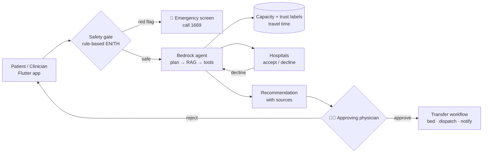
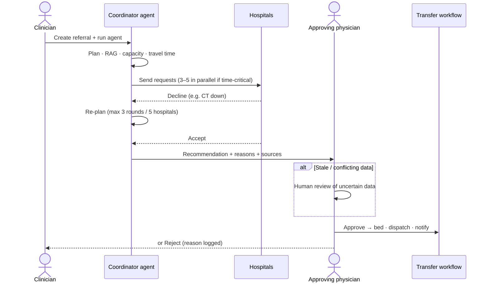
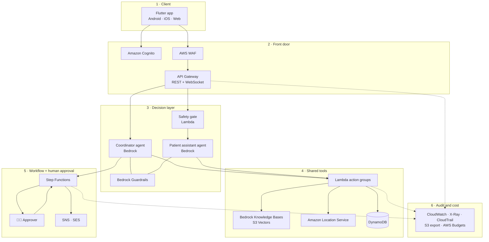

<div align="center">

# SiamCareNode

**Agentic Care Coordination Network**

Built for the **NTT DATA Digital Innovation Challenge 2026**


</div>

> **Design principle:** the agent coordinates; humans and fixed rules decide.
> The model never handles emergency screening or transfer approval.

**Implemented now:** [Phase 1 Python backend](backend/README.md) provides local
hospital discovery and capacity filtering using synthetic JSON data. Run it with
uv; no AWS account is required. The broader architecture and deployment steps below
describe the planned platform.

---

## Table of contents

- [Overview](#overview)
- [How it works](#how-it-works)
- [Roles](#roles)
- [Functional modules](#functional-modules)
- [Key workflows](#key-workflows)
- [AWS architecture](#aws-architecture)
- [Agent design](#agent-design)
- [Mobile app (Flutter)](#mobile-app-flutter)
- [Data model](#data-model)
- [API](#api)
- [Security, privacy and responsible AI](#security-privacy-and-responsible-ai)
- [Repository structure](#repository-structure)
- [Getting started](#getting-started)
- [Testing](#testing)
- [Demo scenarios](#demo-scenarios)
- [Cost efficiency](#cost-efficiency)
- [Scope and constraints](#scope-and-constraints)
- [License](#license)

---

## Overview

Finding a hospital that can take a patient still means a lot of phone calls. SiamCareNode replaces that with an **Amazon Bedrock coordinator agent** that does the following:

1. **Plans** the search from a goal rather than a fixed script.
2. **Retrieves** hospital capabilities through RAG over each hospital's department documents.
3. **Calls tools** for live bed capacity and travel time.
4. **Contacts hospitals**, in parallel when the case is time-critical.
5. **Re-plans** when a hospital declines.
6. **Recommends** one hospital, with reasons and sources, for a human to approve.

Two entry paths share one engine:

| Path | Who | Flow |
|---|---|---|
| 🏥 **Clinician referral** (hospital to hospital) | Doctors, nurses, referral coordinators | The agent contacts 3–5 hospitals in parallel for time-critical cases, or the preferred hospital for routine ones. Staff approve the transfer. |
| 🧑 **Patient search** | Public users, caregivers | The patient describes their need in English or Thai. A rule-based emergency screen runs first. The agent then ranks suitable hospitals with trust labels, and the patient can send a visit request for the hospital to confirm. |

Everyone uses **one Flutter app** (Android, iOS, web), and each role gets its own view.

---

## How it works



---

## Roles

Each of the 13 human roles maps to one **Amazon Cognito group**, and API Gateway authorizers check access on every endpoint.
**Only the Approving physician can approve a transfer. No system role can.**

<details>
<summary><b>Human roles</b> (click to expand)</summary>

| Role | Can do | Cannot do | Cognito group |
|---|---|---|---|
| Guest patient | Describe need, see emergency screen, view ranked hospitals, get directions | Send visit requests, see history | none (rate-limited identity pool) |
| Registered patient | All guest actions, send visit requests, see own status | See others' data, contact hospitals through the agent | `patients` |
| Caregiver | Act for a linked patient with recorded consent | Act for unlinked patients | `patients` (caregiver flag) |
| Referring clinician | Create referrals, start the agent, view trace, reject with reason | Approve own referral | `clinicians` |
| Referral coordinator | View regional referrals, re-run agent, reassign, escalate | Approve transfers | `coordinators` |
| **Approving physician** | **Approve / reject recommendations**, review uncertain data | Edit audit records | `approvers` |
| Receiving hospital staff | Update capacity, accept / decline requests | See other hospitals' referrals | `hospital_staff` (scoped to `hospital_id`) |
| Hospital admin | Manage profile, staff, capability documents | Change other hospitals' data | `hospital_admins` |
| Transport dispatcher | Receive approved transfers, confirm pickup and arrival | See search or referral history | `dispatch` |
| Clinical safety reviewer | Edit red-flag rules (EN/TH), disclaimers, guardrails (versioned) | Deploy without a second reviewer | `safety_reviewers` |
| Compliance auditor | Read audit trail and access logs, export | Change any data | `auditors` (read-only) |
| Platform administrator | Environments, alarms, budgets, user provisioning | Read patient-identifying fields in prod | `platform_admins` |
| Demo operator *(demo only)* | Set mock hospital behavior, reset data, toggle backup mode | Exists only in the demo stage | `demo_operators` |

</details>

<details>
<summary><b>System roles</b> (click to expand)</summary>

| Role | What it does | Runs on | Limits |
|---|---|---|---|
| Safety gate | Rule-based red-flag screen (EN/TH) on every patient message, before any model call | Lambda | The agent cannot bypass it |
| Coordinator agent | Plans, retrieves, calls tools, re-plans, recommends | Bedrock Agents (stronger model) | Has no tool to approve transfers or classify emergencies |
| Patient assistant agent | Understands the need, searches, explains in the user's language | Bedrock Agents (small fast model) | Read-only tools |
| Trust check service | Labels capacity data `fresh` / `stale` / `conflict` | Lambda + EventBridge Scheduler | Deterministic; agents can read labels but not override them |
| Fallback ranker | Rule-based ranking if the agent times out or fails | Lambda | Marked as fallback in the trace |
| Notification service | SMS, email and push | SNS, SES | EN/TH templates only |
| Capacity simulator *(demo only)* | Changes synthetic bed counts and creates stale data | Lambda + EventBridge Scheduler | Off outside the demo stage |

</details>

---

## Functional modules

| # | Module | Key capabilities | AWS services |
|---|---|---|---|
| 1 | Identity and access | Sign-up/in, guest access, role groups, hospital scoping, caregiver consent | Cognito, API Gateway authorizers |
| 2 | Patient intake and safety screen | EN/TH intake, language detection, red-flag screen, 1669 emergency screen | Lambda, Bedrock Guardrails, Amazon Translate |
| 3 | Hospital discovery | Need classification, RAG, metadata filtering, travel time, ranking | Bedrock Knowledge Bases, Amazon Location Service, DynamoDB |
| 4 | Referral orchestration | Goal-driven planning, parallel requests, re-planning, sourced recommendation | Bedrock Agents, Lambda action groups, Step Functions |
| 5 | Hospital response | Accept / decline with reasons, response timeouts | API Gateway, Lambda, Step Functions task tokens |
| 6 | Capacity management | Bed updates, specialty availability, validation, freshness | DynamoDB, Lambda |
| 7 | Trust and data quality | Fresh / stale / conflict labels, conflict detection | Lambda, EventBridge Scheduler, DynamoDB Streams |
| 8 | Human review and approval | Review queue, approve / reject with reason, reassign | Step Functions, DynamoDB |
| 9 | Transfer coordination | Bed reservation, dispatch, receiving team notice, summary | Step Functions, Lambda, SNS |
| 10 | Notifications | SMS, email and push in EN/TH | SNS, SES |
| 11 | Localization | Flutter ARB strings, agent reply language, Thai rules, bundled Thai font | Flutter, Amplify Hosting |
| 12 | Audit and compliance | Immutable log of agent steps, safety decisions and human actions | DynamoDB, CloudTrail, CloudWatch Logs, S3 |
| 13 | Administration and content | Hospital profiles, staff, capability docs, safety rule versions | S3, Bedrock KB sync, DynamoDB |
| 14 | Metrics and demo control | Time to placement, contacts per placement, cost per referral, mock behavior | CloudWatch, AWS Budgets, DynamoDB |

Modules 1–11 are the product. Modules 12–14 support operations and the demo.

---

## Key workflows

### 1. Clinician referral (the agentic core)



### 2. Patient search

1. The patient or caregiver types their need in **English or Thai** (as a guest or signed in).
2. The **safety gate** checks red-flag rules. A match stops the flow and shows the **1669 emergency screen**, and no model is called.
3. The **patient assistant agent** detects the language, classifies the need and retrieves capable hospitals.
4. It checks capacity, trust labels and travel time.
5. It shows ranked hospitals with trust labels, in the patient's language.
6. *Optional:* a signed-in patient sends a visit request, the hospital accepts or declines, and the patient gets an SMS.

### 3. Hospital capacity and trust

1. Staff update free beds. In the demo, the simulator can do this instead.
2. The update is validated (between 0 and total beds), saved as a timestamped snapshot and audited.
3. **Every 5 minutes** the trust check labels each hospital:
   - 🟢 **fresh**: updated in the last 30 minutes or less
   - 🟡 **stale**: older than that
   - 🔴 **conflict**: free beds are shown but recent requests were declined
4. Stale or conflicting data forces **human review** in referrals and shows a **call-ahead warning** to patients.

### 4. Transfer

Approval resumes the Step Functions workflow. The system reserves the bed, notifies dispatch and the receiving ward, and shares the referral summary. Dispatch then confirms pickup and arrival. Every step is audited.

---

## AWS architecture

All traffic comes in through one front door. Patient messages pass the rule-based safety gate before any model call. Both agents share one tool library, and every transfer stops at a human approver.



<details>
<summary><b>Full AWS service inventory</b> (click to expand)</summary>

| Need | AWS service | Use |
|---|---|---|
| Team access | IAM Identity Center | One sign-in per teammate, MFA |
| App sign-in and roles | Amazon Cognito | User pool with 13 groups; identity pool for guests |
| Flutter auth | AWS Amplify Flutter (Auth) | Sign-in, token refresh, guest identity |
| API | Amazon API Gateway | REST API and WebSocket API for the live agent trace |
| API protection | AWS WAF | Managed rules, rate limits |
| Business logic | AWS Lambda (Python 3.12) | API handlers, agent tools, trust check, fallback ranker |
| AI agents | Amazon Bedrock Agents | Coordinator and patient assistant |
| Models | Amazon Bedrock (Claude, multilingual embeddings) | Planning, EN/TH replies, RAG embeddings |
| RAG | Bedrock Knowledge Bases | Custom-chunked department docs |
| Vector store | Amazon S3 Vectors *(or Aurora Serverless pgvector)* | Low idle cost |
| AI safety | Bedrock Guardrails | Denied topics, PII masking, content filters |
| Thai safety backup | Amazon Translate | Second guardrail check on translated input |
| Workflow | AWS Step Functions | Referral, approval, timeouts, transfer |
| Scheduling | EventBridge Scheduler | Trust check every 5 min; capacity simulator |
| Operational data | Amazon DynamoDB | 8 on-demand tables with streams and TTL |
| Files | Amazon S3 | KB docs, audit exports, APK downloads |
| Encryption | AWS KMS | DynamoDB, S3, logs |
| Config and secrets | SSM Parameter Store, Secrets Manager | Stage settings, server-side secrets |
| Maps and ETAs | Amazon Location Service | Route matrix, map tiles |
| SMS / email / push | Amazon SNS (+ FCM/APNs), Amazon SES | EN/TH notifications |
| Web hosting | AWS Amplify Hosting | Flutter web build |
| CI/CD | CodePipeline, CodeBuild, CodeConnections | Tests, CDK deploys, APK and web builds |
| Device testing | AWS Device Farm | Flutter integration tests on real phones |
| IaC | AWS CDK (TypeScript), CloudFormation | All stacks per stage |
| Observability | CloudWatch, X-Ray, CloudTrail | Dashboards, tracing, account audit |
| Cost control | AWS Budgets, Cost Explorer | Monthly alert, cost per referral |
| Coding assistant | Claude Code on Amazon Bedrock | Used to build the project |

Two things are not on AWS: **TestFlight** (Apple requires it for iOS test builds) and the **Flutter and Dart** libraries. Source code is hosted on GitHub.

</details>

---

## Agent design

There are two Bedrock agents. Each gets a **goal, not a script**, and every step is streamed to the app as a trace.

| Agent | Used for | Model |
|---|---|---|
| **Coordinator** | Clinician referrals | A stronger Claude model, for multi-step planning and reading free-text hospital replies |
| **Patient assistant** | Patient search | A small, fast Claude model (e.g. Claude Haiku), for low cost and latency |
| *Embeddings* | Cross-language RAG | A multilingual model (e.g. Cohere Embed Multilingual), so Thai queries find English docs |

### Tool library (Bedrock action groups, one Lambda each)

| Tool | Output | Coordinator | Patient assistant |
|---|---|:-:|:-:|
| `search_capabilities` | Hospitals with cited KB chunks | ✅ | ✅ |
| `get_capacity` | Free beds, last update, trust label | ✅ | ✅ |
| `get_travel_times` | Minutes per hospital (Location route matrix) | ✅ | ✅ |
| `send_referral_request` | Request IDs | ✅ | ❌ |
| `check_request_status` | Accepted / declined + reason / waiting | ✅ | ❌ |
| `cancel_request` | Confirmation | ✅ | ❌ |
| `submit_recommendation` | Puts the case in the approval queue | ✅ | ❌ |
| `write_audit_note` | Audit entry ID | ✅ | ✅ |

> 🔒 **No tool approves a transfer, overrides a trust label, or decides whether a case is an emergency.**

### Coordinator instructions (summary)

```text
Goal: find one hospital that has the required capability, has capacity, and accepts.
1. Retrieve capable hospitals with search_capabilities. Use only hospitals it returns.
2. Check capacity and travel time. Prefer fresh data; treat stale or conflicting data as uncertain.
3. Time-critical: request the best 3 to 5 in parallel. Routine: request the preferred hospital first.
4. When a hospital declines or times out, explain why and re-plan. Stop after 3 rounds or 5 hospitals.
5. Submit one recommendation with reasons and source IDs. Never approve a transfer.
6. Reply in the user's language (English or Thai). Never give a diagnosis or treatment advice.
```

### Guardrails and limits

- **Bedrock Guardrails** on both agents: denied topics (diagnosis, medication dosing, treatment advice), PII masking and harmful content filters. Thai input is also translated and checked in English.
- **Agent turn timeout:** 20 seconds for time-critical cases. After that, the **fallback ranker** returns a rule-based list.
- **Hospital response timeout:** 3 minutes for time-critical cases and 30 minutes for routine ones. These are demo values that still need to be confirmed with clinicians.

---

## Mobile app (Flutter)

One codebase builds the **Android, iOS and web** apps. The app only talks to AWS through Cognito sign-in, the REST API and the WebSocket trace stream. It holds **no AWS keys**.

| Layer | Responsibility | Packages |
|---|---|---|
| Presentation | Screens and widgets per role | Material 3, `go_router` |
| State | One provider per feature | `flutter_riverpod` |
| Data | Repositories, JSON ↔ models | `dio`, `freezed`, `json_serializable` |
| Core services | Auth, trace stream, safety rules, i18n, config | `amplify_flutter`, `amplify_auth_cognito`, `web_socket_channel`, `flutter_localizations` |
| Platform | Call 1669, settings, fonts | `url_launcher`, `shared_preferences` |

**Highlights**

- **Role-based home:** the app reads the user's Cognito groups from the ID token and opens the right home screen. Users in several groups get a role switcher.
- **Live agent trace:** a WebSocket streams each step as it happens (plan, RAG, tool call, observation, re-plan, output). If the connection drops, the app reconnects with backoff and catches up from `GET /referrals/{id}/trace`.
- **Offline safety:** the EN/TH red-flag rules ship inside the app, so the emergency screen and the 1669 button work with **no network**. The server-side gate still makes the final call.
- **Bilingual:** strings live in `app_en.arb` and `app_th.arb`. The app follows the phone's language, saves the user's toggle choice and bundles a Thai font.
- **Accessibility:** supports system text size, screen-reader labels, 48 px touch targets, and contrast that works in light and dark mode.
- **Privacy:** the demo uses preset Bangkok locations. Device GPS sits behind a feature flag.

| Target | Command | Delivered by |
|---|---|---|
| Android | `flutter build apk --dart-define-from-file=env/demo.json` | Private S3 bucket, time-limited link |
| iOS | `flutter build ipa --dart-define-from-file=env/demo.json` | TestFlight |
| Web | `flutter build web --dart-define-from-file=env/demo.json` | AWS Amplify Hosting |

---

## Data model

Operational data is kept in **8 DynamoDB tables** (on-demand). Hospital capability knowledge is kept in **S3 as one Markdown file per hospital department**, indexed by Bedrock Knowledge Bases.

| Table | PK | SK | Notes |
|---|---|---|---|
| `Hospitals` | `hospital_id` | — | names EN/TH, lat/lng, specialties, beds, NICU / stroke level; GSI by region |
| `CapacitySnapshots` | `hospital_id` | `updated_at` | free beds, ICU free, source; **stream → trust check** |
| `TrustState` | `hospital_id` | — | label (fresh / stale / conflict), reason |
| `Referrals` | `referral_id` | — | urgency, need, status, recommendation, approver; GSIs by region+status, creator |
| `HospitalRequests` | `referral_id` | `request_id` | type (referral / visit), status, `task_token`; TTL on `expires_at` |
| `AgentTraces` | `referral_id` | `step_no` | step type, text, sources, latency |
| `AuditLog` | `entity_id` | `timestamp#event_id` | actor, action, before/after; exported to S3 daily |
| `DemoScenarios` | `hospital_id` | — | accept / decline / timeout behavior *(demo only)* |

<details>
<summary><b>Knowledge base document example</b></summary>

`kb/H03/maternity.md`

```markdown
# Northbay Women's and Children's: Maternity
Capabilities: 24/7 obstetric team, operating theatre for caesarean section,
level III NICU (12 cots).
Accepts transfers: preterm labour from 24 weeks; high-risk pregnancy.
Does not accept: adult trauma.
Transfer contact: maternity charge nurse via referral desk.
```

`kb/H03/maternity.md.metadata.json`

```json
{
  "metadataAttributes": {
    "hospital_id": "H03",
    "specialty": "maternity",
    "nicu_level": 3,
    "language": "en",
    "synthetic": true
  }
}
```

A custom chunking Lambda splits documents on department headings, so each chunk is self-contained and Thai text is never cut mid-word.

</details>

---

## API

All apps use one REST API (`/v1`) on API Gateway. Each route has a Cognito authorizer, and Lambda enforces hospital scoping. Agent traces stream over a **WebSocket API**.

| Method | Path | Purpose | Allowed roles |
|---|---|---|---|
| `POST` | `/patient/search` | Safety screen, then agent search | Guest, patients, caregivers |
| `POST` | `/patient/visits` | Send a visit request | Patients, caregivers |
| `GET` | `/patient/visits/{id}` | Visit status | Owner |
| `POST` | `/referrals` | Create a referral | Clinicians, coordinators |
| `POST` | `/referrals/{id}/run` | Start coordinator agent | Clinicians, coordinators |
| `GET` | `/referrals/{id}` | Referral, recommendation, trust labels | Creator, coordinators, approvers |
| `GET` | `/referrals/{id}/trace` | Agent trace steps | Creator, coordinators, approvers, auditors |
| `POST` | `/referrals/{id}/approve` | Approve and start the transfer | **Approvers** |
| `POST` | `/referrals/{id}/reject` | Reject with a required reason | Approvers, clinicians |
| `POST` | `/referrals/{id}/reassign` | Reassign | Coordinators |
| `GET` | `/hospital/requests` | Incoming requests for own hospital | Hospital staff |
| `POST` | `/hospital/requests/{id}/respond` | Accept / decline (resumes the task token) | Hospital staff |
| `PUT` | `/hospital/capacity` | Update free beds | Hospital staff, admins |
| `PUT` | `/hospital/profile` | Edit profile, upload capability docs | Hospital admins |
| `POST` | `/dispatch/{transferId}/status` | Confirm pickup / arrival | Dispatch |
| `GET` | `/audit` | Query audit log | Auditors |
| `PUT` | `/admin/safety-rules` | Propose a red-flag rule version (needs second approval) | Safety reviewers |
| `PUT` | `/demo/scenarios/{hospitalId}` | Set mock hospital behavior | Demo operator |
| `POST` | `/demo/reset` | Reset synthetic data | Demo operator |

Errors return a code and a message in the caller's language, with no internal details. **Every write creates an `AuditLog` entry.**

---

## Security, privacy and responsible AI

| Area | Control |
|---|---|
| **Human approval** | A transfer starts only after an approver acts. Uncertain data forces human review. |
| **Safe boundaries** | A rule-based emergency screen runs before the agent. The agent has no approve or emergency tools. |
| **Guardrails** | Denied topics, PII masking, content filters, plus a backup check on Thai input via translation |
| **Escalation** | 1669 emergency screen; human review for stale or conflicting data; fallback ranker on agent timeout |
| **Disclaimers** | Shown on every patient screen in EN/TH and reviewed by a Thai-speaking clinician |
| **Audit trail** | Every agent step, safety decision and human action is logged and exported daily |
| **Privacy** | Synthetic data only, minimum fields per referral, preset locations instead of GPS, PDPA review before any real use |
| **Encryption** | KMS at rest, TLS in transit |
| **Least privilege** | One IAM role per Lambda, scoped to its own tables and actions |
| **Abuse protection** | Rate limits on guest search, WAF managed rules |
| **Fairness** | Ranking uses only capability, capacity, data reliability and travel time, never insurance or ability to pay |
| **Change control** | Safety rule changes need a second reviewer and are versioned |

---

## Repository structure

This is the planned layout, a monorepo with four parts:

```text
.
├── README.md
├── CLAUDE.md                 # rules for Claude Code sessions
├── buildspecs/               # CodeBuild: ci.yml, deploy.yml
├── docs/                     # architecture, roles, api, demo script
├── infra/                    # AWS CDK (TypeScript)
│   ├── bin/carerelay.ts
│   ├── config/               # dev.json, demo.json, prod.json
│   └── lib/                  # auth, data, knowledge, agent, api, workflow,
│                             # location, notify, observability, hosting,
│                             # pipeline, distribution, demo stacks
├── backend/                  # Python 3.12 Lambdas
│   ├── shared/               # auth, audit, i18n, trust, ddb, errors
│   ├── functions/            # safety_gate, patient_search, referrals, approvals,
│   │                         # capacity, trust_check, fallback_ranker, transfer, ...
│   ├── agent_tools/          # one folder per tool: handler.py + openapi.yaml
│   ├── agents/               # coordinator/, patient_assistant/, guardrails/
│   ├── workflows/            # referral / visit / transfer .asl.json
│   └── demo/                 # mock_hospital_api, capacity_simulator, scenario_control
├── mobile/                   # Flutter app (Android, iOS, web)
│   ├── assets/               # fonts (Noto Sans Thai), safety red-flag rules
│   └── lib/
│       ├── core/             # api, auth, router, safety, theme
│       ├── models/           # freezed models
│       ├── widgets/          # trace_line, hospital_card, trust_badge, ...
│       └── features/         # patient, clinician, coordinator, approver,
│                             # hospital, dispatch, safety_review, audit, admin, demo
├── data/                     # synthetic data generator, 20 hospitals, KB docs, scenarios
├── tests/                    # integration, agent_evals, safety, e2e (Device Farm)
└── scripts/                  # deploy, seed-demo, reset-demo, export-outputs, ...
```

---

## Getting started

### Prerequisites

- An AWS account with Bedrock model access (Claude and multilingual embeddings) in your chosen region
- Node.js + AWS CDK, Python 3.12, Flutter SDK
- *(iOS only)* an Apple developer account for TestFlight

> ⚠️ Before you start, check that the models, Bedrock Knowledge Bases and S3 Vectors are available in your chosen region.

### Deploy

```bash
# 1. Bootstrap CDK (once per account/region)
cdk bootstrap

# 2. Deploy all stacks in dependency order
#    auth → data → location → knowledge → agent → workflow → api → notify → observability → hosting → demo
scripts/deploy.sh demo

# 3. Generate synthetic hospitals, load DynamoDB, upload KB docs, start ingestion
scripts/seed-demo.sh

# 4. Run safety tests and agent evals before every rehearsal
#    (tests/safety, tests/agent_evals)

# 5. Restore the starting state before the pitch
scripts/reset-demo.sh

# 6. Export CDK outputs to the app config, then build
scripts/export-outputs.sh demo        # writes mobile/env/demo.json
cd mobile && flutter build apk --dart-define-from-file=env/demo.json
cd mobile && flutter build web --dart-define-from-file=env/demo.json
```

### Environments

| Stage | Purpose | Notes |
|---|---|---|
| `dev` | Daily building and testing | Capacity simulator on, verbose logs |
| `demo` | Live pitch | Demo operator, mock hospitals, scenario control, backup mode |
| `prod` *(future)* | Pilot with a real referral center | No demo stack, real accounts, PDPA review, data integration |

CI/CD: **CodePipeline** (connected to GitHub through CodeConnections) runs `flutter analyze` and the unit, widget and safety tests on every PR. On merge to `main`, it deploys with CDK, builds the APK and web bundle, and runs **Device Farm** tests.

---

## Testing

| Layer | What is tested |
|---|---|
| **Safety** | Every phrase in `red_flags_en.csv` / `red_flags_th.csv` must trigger the emergency screen, and the safe phrases must not. Runs in CI on every change. |
| **Permissions** | Every API route is called by every role. Only the allowed roles may succeed. |
| **Agent evals** | Each scenario runs 10 times. It passes if the agent picks a capable hospital, cites sources, re-plans after a decline and **never approves**. Median time and token use are recorded. |
| **End-to-end** | Flutter integration tests for every role's main flow in both languages, on real devices in AWS Device Farm |

---

## Demo scenarios

| Scenario | What it proves |
|---|---|
| 🧠 Suspected stroke, time-critical; the nearest hospital declines (CT down) | Planning, RAG, tool calls, re-planning, human approval |
| ❤️ STEMI with conflicting capacity data at the nearest hospital | Trust labels, human review of uncertain data |
| 🤰 Patient types in Thai about pregnancy cramps | Bilingual reply, cross-language RAG, trust labels |
| 🚨 Patient types "chest pain" in Thai | Emergency screen with 1669 **before any AI call** |
| 📱 Hospital staff update capacity on a second phone | Live data; the stale label turns fresh |
| 🛑 Demo operator slows or blocks the Bedrock call | Graceful fallback, no dead end |

The demo ends on the **audit trail** and the measured before/after result: median time to an accepted placement, compared with a simulated phone-call process.

---

## Cost efficiency

Everything is **serverless and pay-per-use**, so idle cost is close to zero. The exceptions are the vector store and the map tiles.
The main costs per referral are model tokens, Lambda invocations, Step Functions transitions and route matrix calls. Using the **small model for patient search** and the **stronger model only for referral planning** keeps token costs down.

Cost tracking: AWS Pricing Calculator estimates, a CloudWatch usage dashboard, and an AWS Budgets alert for the competition month.

---

## Scope and constraints

- ⏱️ 14-day build on AWS serverless, kept cost-efficient
- 🧪 **Synthetic data only**: fictional hospitals at real Bangkok coordinates, with no real hospital agreements and no real patient data
- 🌐 Bilingual: English and Thai UI, and the agent replies in the user's language
- 🚫 Out of scope: insurance, EHR/HIS integration, real payments, public app-store release

> **Disclaimer:** CareRelay is a hackathon prototype. It does not provide medical advice, diagnosis or treatment. In an emergency in Thailand, call **1669**.

---

## License

[MIT](LICENSE) © 2026 Albert Zaw Sam
